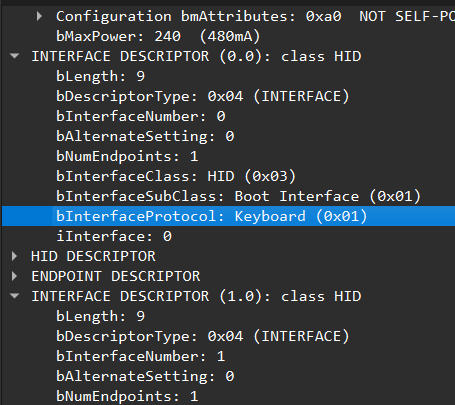
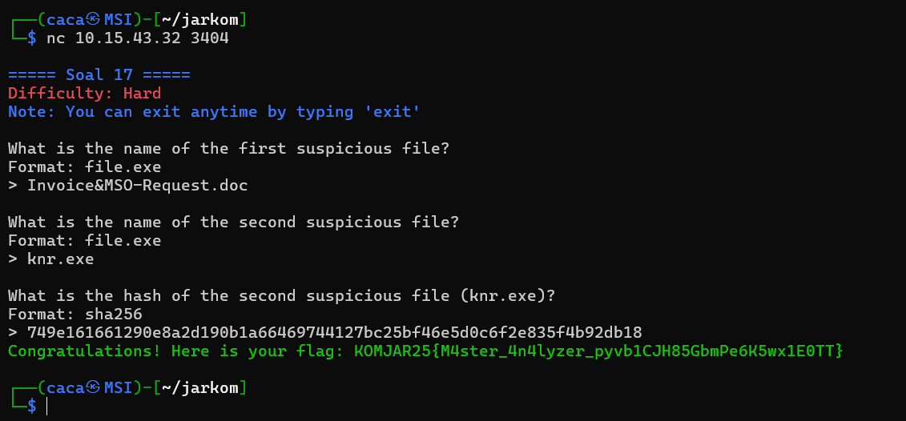

# Jarkom-Modul-1-2025-K-13

| Nama                   | NRP        |
|-------------------------|------------|
| Maritza Adelia Sucipto | 5027241111 |
| Ahmad Rabbani Fata     | 5027241046 |

## Soal 1 - 13

### Soal 1
Untuk mempersiapkan pembuatan entitas selain mereka, Eru yang berperan sebagai Router membuat dua Switch/Gateway. Dimana Switch 1 akan menuju ke dua Ainur yaitu Melkor dan Manwe. Sedangkan Switch 2 akan menuju ke dua Ainur lainnya yaitu Varda dan Ulmo. Keempat Ainur tersebut diberi perintah oleh Eru untuk menjadi Client.


### Soal 2
Karena menurut Eru pada saat itu Arda (Bumi) masih terisolasi dengan dunia luar, maka buat agar Eru dapat tersambung ke internet

`
auto eth0
iface eth0 inet dhcp
`

konfigurasi diatas digunakan untuk menghubungkan Eru dengan internet

### Soal 3
Sekarang pastikan agar setiap Ainur (Client) dapat terhubung satu sama lain.

`
auto eth1                   
iface eth1 inet static
	address 10.70.1.1
	netmask 255.255.255.0
`

config diatas digunakan untuk menghubungkan Eru dengan switch 1

`
auto eth2                   
iface eth2 inet static
	address 10.70.2.1
	netmask 255.255.255.0
`

config diatas digunakan untuk menghubungkan Eru dengan switch 2

`
auto eth0                  
iface eth0 inet static
	address 10.70.1.2
	netmask 255.255.255.0
	gateway 10.70.1.1
`

config diatas digunakan untuk menghubungkan switch 1 dengan Melkor

`
auto eth0                   
iface eth0 inet static
	Address 10.70.1.3
	netmask 255.255.255.0
	gateway 10.70.1.1
`

config diatas digunakan untuk menghubungkan switch 1 dengan Manwe

`
auto eth0                   
iface eth0 inet static
	address 10.70.2.2
	netmask 255.255.255.0
	gateway 10.70.2.1
 `
 
config diatas digunakan untuk menghubungkan switch 2 dengan Varda

`
auto eth0                   
iface eth0 inet static
	Address 10.70.2.3
	netmask 255.255.255.0
	Gateway 10.70.2.1
 `
 
config diatas digunakan untuk menghubungkan switch 2 dengan Ulmo

### Soal 4
Setelah berhasil terhubung, sekarang Eru ingin agar setiap Ainur (Client) dapat mandiri. Oleh karena itu pastikan agar setiap Client dapat tersambung ke internet.

`
apt update && apt install  iptables -y
`

menginstall iptables supaya bisa mengkonfigurasi NAT

`
iptables -t nat -A POSTROUTING -o eth0 -j MASQUERADE -s10.70.0.0/16
`

Membuat Eru menjadi gateway jaringan internet

`
cat /etc/resolv.conf
`

digunakan untuk mengecek ip di config resolve

`
Echo nameserver [IP] > /etc/resolv.conf
`

digunakan supaya ip di config resolve bisa terbaca oleh client (dilakukan untuk semua client)

### Soal 5
Ainur terkuat Melkor tetap berusaha untuk menanamkan kejahatan ke dalam Arda (Bumi). Sebelum terjadi kerusakan, Eru dan para Ainur lainnya meminta agar semua konfigurasi tidak hilang saat semua node di restart.

supaya konfigurasi tidak hilang ketika di restart, konfigurasi bisa disimpan di /root/ sebelum keluar dari project sehingga tidak reset

### Soal 6
Setelah semua Ainur terhubung ke internet, Melkor mencoba menyusup ke dalam komunikasi antara Manwe dan Eru. Jalankan file berikut (link file) lalu lakukan packet sniffing menggunakan Wireshark pada koneksi antara Manwe dan Eru, lalu terapkan display filter untuk menampilkan semua paket yang berasal dari atau menuju ke IP Address Manwe. Simpan hasil capture tersebut sebagai bukti.


## Soal 14 - 20
> untuk soal 14 - 20, kita perlu mendownload file zip yang diberikan kemudian membuka file pcapng(wireshark) dan di terminal ketik nc sesuai yang diberikan di soal
> 
### Soal 14
Setelah gagal mengakses FTP, Melkor melancarkan serangan brute force terhadap  Manwe. Analisis file capture yang disediakan dan identifikasi upaya brute force Melkor. nc 10.15.43.32 3401

### a. How many packets are recorded in the pcapng file?
```bash
500358
```
 lihat jumlah paket di bagian bawah kanan di wireshark
 
 ### b. What are the user that successfully logged in?
```bash 
n1enna:y4v4nn4_k3m3nt4r1
```
display filter ```frame contains “success”``` untuk menemukan user yang berhasil log in, akan muncul 1 packet, klik kanan packet -> **follow -> TCP stream**. Maka akan terlihat username dan juga passwordnya


### c. In which stream were the credentials found?
```bash 
41824
```
lihat dipojok kanan bawah atau setelah close TCP stream akan muncul di display filter untuk streamnya 


### d. What tools are used for brute force?
```bash 
Fuzz Faster U Fool v2.1.0-dev
```
lihat di TCP stream di bagian User-Agent (baris ke 3) 

setelah menyelesaikan semua pertanyaan kita akan mendapatkan flag:
```bash 
KOMJAR25{Brut3_F0rc3_k29eoD0KSbaBG9ZMd005q909j}
```

### Soal 15
Melkor menyusup ke ruang server dan memasang keyboard USB berbahaya pada node Manwe. Buka file capture dan identifikasi pesan atau ketikan (keystrokes) yang berhasil dicuri oleh Melkor untuk menemukan password rahasia. nc 10.15.43.32 3402

### a. What device does Melkor use?
 ```bash 
Keyboard
```
cek packetnya dan di bagian interface descriptor, tertulis bInterfaceProtocol: Keyboard (0x01) atau dari soal juga dijelaskan USB Keyboard



### Soal 16
Melkor semakin murka ia meletakkan file berbahaya di server milik Manwe. Dari file capture yang ada, identifikasi file apa yang diletakkan oleh Melkor. nc 10.15.43.32 3403

### a. What credential did the attacker use to log in?
 ```bash 
ind@psg420.com:{6r_6e#TfT1p
```
display filter: ```frame contains "user"``` untuk mencari string "user" di seluruh bagian paket, klik salah satu packet -> **follow -> TCP stream**
di packet pertama yang saya buka, sudah ketemu user dan juga passwordnya

### b. How many files are suspected of containing malware?
```bash 
5
```
jenis file malware yang paling umum adalah .exe, maka kita hitung ada berapa file .exe di TCP stream. Totalnya ada 5 malware (5 file .exe)

### c. What is the hash of the first file (q.exe)?
```bash 
ca34b0926cdc3242bbfad1c4a0b42cc2750d90db9a272d92cfb6cb7034d2a3bd
```

### d. What is the hash of the second file (w.exe)?
```bash 
08eb941447078ef2c6ad8d91bb2f52256c09657ecd3d5344023edccf7291e9fc
```

### e. What is the hash of the third file (e.exe)?
```bash 
32e1b3732cd779af1bf7730d0ec8a7a87a084319f6a0870dc7362a15ddbd3199
```

### f. What is the hash of the fourth file (r.exe)?
```bash 
4ebd58007ee933a0a8348aee2922904a7110b7fb6a316b1c7fb2c6677e613884
```
### g. What is the hash of the fifth file (t.exe)?
```bash 
10ce4b79180a2ddd924fdc95951d968191af2ee3b7dfc96dd6a5714dbeae613a
```

untuk soal 16c - 16g download file .exe dalam format **raw**, pindahkan ke linux, kemudian buka terminal baru dan masuk ke folder tempat file tersebut
command: ```sha256sum <namafile>```

setelah menyelesaikan semua pertanyaan kita akan mendapatkan flag:
```bash 
KOMJAR25{Y0u_4r3_4_g00d_4nalyz3r_IfdYDdJncH98aj75bbRW9Uv06}
```


### Soal 17
Manwe membuat halaman web di node-nya yang menampilkan gambar cincin agung. Melkor yang melihat web tersebut merasa iri sehingga ia meletakkan file berbahaya agar web tersebut dapat dianggap menyebarkan malware oleh Eru. Analisis file capture untuk menggagalkan rencana Melkor dan menyelamatkan web Manwe.

### a. What is the name of the first suspicious file?
```bash 
Invoice&MSO-Request.doc
```
 klik **file -> export objects -> HTTP** karena protokol network yang paling umum untuk Malware adalah HTTP
 muncul 3 file, tapi karena yang memiliki high risk sebagai malware adalah application untuk file pertama kita pakai yang **Invoice&MSO-Request.doc**
 
 ### b. What is the name of the second suspicious file?
 ```bash 
knr.exe
```
sama seperti soal sebelumnya, kali ini gunakan file terakhir

### c. What is the hash of the second suspicious file (knr.exe)?
```bash 
749e161661290e8a2d190b1a66469744127bc25bf46e5d0c6f2e835f4b92db18
```
untuk menemukan file hashnya sama seperti di nomor sebelumnya

setelah menyelesaikan semua pertanyaan kita akan mendapatkan flag:
 ```bash 
 KOMJAR25{M4ster_4n4lyzer_pyvb1CJH85GbmPe6K5wx1E0TT}
```

 
### Soal 18
Karena rencana Melkor yang terus gagal, ia akhirnya berhenti sejenak untuk berpikir. Pada saat berpikir ia akhirnya memutuskan untuk membuat rencana jahat lainnya dengan meletakkan file berbahaya lagi tetapi dengan metode yang berbeda. Gagalkan lagi rencana Melkor dengan mengidentifikasi file capture yang disediakan agar dunia tetap aman. (link file) nc 10.15.43.32 3405

### a. How many files are suspected of containing malware?
```bash 
2
```
 karena dijelaskan di soal kalau menggunakan metode yang berbeda (selain HTTP), cek object list yang lain, dan yang muncul file hanya SMB. Lihat file yang .exe saja
 
 ### b. What is the name of the first malicious file?
 ```bash 
d0p2nc6ka3f_fixhohlycj4ovqfcy_smchzo_ub83urjpphrwahjwhv_o5c0fvf6.exe
```
lihat nama filenya di bagian filename

### c. Apa nama file berbahaya yang kedua?
```bash 
oiku9bu68cxqenfmcsos2aek6t07_guuisgxhllixv8dx2eemqddnhyh46l8n_di.exe
```

### d. What is the hash of the first malicious file?
```bash 
59896ae5f3edcb999243c7bfdc0b17eb7fe28f3a66259d797386ea470c010040
```
### e. What is the hash of the second malicious file?
```bash 
cf99990bee6c378cbf56239b3cc88276eec348d82740f84e9d5c343751f82560
```
untuk menemukan file hashnya sama seperti sebelumnya
 

setelah menyelesaikan semua pertanyaan kita akan mendapatkan flag:
```bash 
KOMJAR25{Y0u_4re_g0dl1ke_FWeYgdADqZRzVM7cBZ3KdGKEu}
```

### Soal 19
Manwe mengirimkan email berisi surat cinta kepada Varda melalui koneksi yang tidak terenkripsi. Melihat hal itu Melkor sipaling jahat langsung melancarkan aksinya yaitu meneror Varda dengan email yang disamarkan. Analisis file capture jaringan dan gagalkan lagi rencana busuk Melkor. nc 10.15.43.32 3406
 
### a. Who sent the threatening message?
```bash 
Your Life
```
 Display filter: ```smtp``` Klik kanan -> **follow -> TCP stream**
 karena SMTP menangani pengiriman pesan di jaringan
 
 
 ### b. How much ransom did the attacker demand ($)?
 ```bash 
1600
```
Kita bisa mencari jawabannya dengan membaca pesannya
 
### c. What is the attacker's bitcoin wallet?
```bash 
1CWHmuF8dHt7HBGx5RKKLgg9QA2GmE3UyL
```
oiku9bu68cxqenfmcsos2aek6t07_guuisgxhllixv8dx2eemqddnhyh46l8n_di.exe
Kita bisa mencari jawabannya dengan membaca pesannya
 
 
setelah menyelesaikan semua pertanyaan kita akan mendapatkan flag:
```bash 
KOMJAR25{Y0u_4re_J4rk0m_G0d_YNMPF5MYCP70wlgyVVIfvmHaE}
```

### Soal 20
Untuk yang terakhir kalinya, rencana besar Melkor yaitu menanamkan sebuah file berbahaya kemudian menyembunyikannya agar tidak terlihat oleh Eru. Tetapi Manwë yang sudah merasakan adanya niat jahat dari Melkor, ia menyisipkan bantuan untuk mengungkapkan rencana Melkor. Analisis file capture dan identifikasi kegunaan bantuan yang diberikan oleh Manwë untuk menggagalkan rencana jahat Melkor selamanya. nc 10.15.43.32 3407
 
 
di soal ini diberikan file txt, sehingga kita masukkan filenya dengan cara **Edit -> Preferences -> Protocol -> TLS** lalu tambahkan filenya

### a. What encryption method is used?
```bash 
TLS
```
karena TLS merupakan protocol dengan probabilitas tertinggi sebagai kanal penyembunyian data (traffic terenkripsi & umum)
 

 ### b. What is the name of the malicious file placed by the attacker?
 ```bash 
invest_20.dll
```
file -> export objects -> HTTP (cari file application dengan ekstensi)

### c. What is the hash of the file containing the malware?
```bash 
31cf42b2a7c5c558f44cfc67684cc344c17d4946d3a1e0b2cecb8eb58173cb2f
```
 
 
setelah menyelesaikan semua pertanyaan kita akan mendapatkan flag:
```bash 
KOMJAR25{B3ware_0f_M4lw4re_kymFRy5FM3N2vd6FCSthfl99E}
```
